# Database Architecture & Schema Design

## RLS & Ownership Resolution (Denormalization Tradeoff)
For Row Level Security (RLS), we use a **second-hop join pattern** for tables not directly containing `candidate_id` (e.g., `project_metrics` checking `candidate_projects`). 
While adding a denormalized `candidate_id` directly to second-hop and third-hop tables would make RLS policies flatter and slightly faster, it introduces normalization impurities and complex state-sync requirements during inserts. Our design explicitly accepts the slight performance overhead of nested `IN (SELECT ...)` subqueries to preserve schema purity. If read performance on nested tables degrades significantly, denormalizing `candidate_id` is the documented fallback strategy.

## Indexing Strategy
Hybrid retrieval (the core RAG mechanism in Stage 3) depends entirely on `document_chunks` being indexed for both semantic and lexical queries. Reciprocal rank fusion over BOTH result sets is required because:
1. **Semantic (HNSW Vector Index)**: We query cosine similarity over the `embedding` vector for conceptual matches (e.g., "handled ambiguous requirements") that share no exact words with the source text. 
2. **Lexical (GIN Full-Text Index)**: We full-text search over `content_tsv` for exact technical terms (like specific library names or metric values) that a semantic embedding might underweight.

An index on only one side silently degrades the other retrieval path to a full table scan, killing performance at scale. 

**HNSW vs IVFFlat**: We use HNSW (Hierarchical Navigable Small World) instead of IVFFlat. HNSW performs well immediately at portfolio/demo data volumes (hundreds of chunks) without needing a pre-training/build step proportional to a minimum row count, whereas IVFFlat recall is poor at low volumes.
**Cosine Distance**: We use `vector_cosine_ops` because embedding similarity from normalized sentence-transformer models (like `bge-small-en-v1.5`) maps correctly to cosine distance. Stage 3 must either use pre-normalized models or normalize embeddings explicitly.

### Verification (EXPLAIN ANALYZE)
*HNSW Index Usage Plan (Vector Query):*
```text
[PENDING VERIFICATION - RUN scripts/verify-indexes.py to populate]
```

*GIN Index Usage Plan (Full-Text Query):*
```text
[PENDING VERIFICATION - RUN scripts/verify-indexes.py to populate]
```

## Conventions
- **Primary keys**: `id uuid primary key default gen_random_uuid()`
- **Timestamps**: Every table has `created_at timestamptz not null default now()`.
- **Updated at**: Every mutable table has `updated_at timestamptz not null default now()`, maintained by ONE shared trigger function (`set_updated_at()`), rather than duplicated logic per table.
- **Foreign keys**: `<referenced_table_singular>_id uuid` — e.g., `candidate_id` (not `cand_id` or `candidateId`).
- **Enums**: We use Postgres `text` with a `check` constraint against a literal list instead of native `enum` types. This is because `text`+`check` is trivially alterable with a migration (`alter table ... drop constraint ... add constraint ...`), whereas native enum value changes are historically awkward and complex in Postgres. We state this explicitly as a design decision.
- **Soft deletes**: Soft-deletable data is marked with `deleted_at timestamptz` only where explicitly needed (e.g., `applications`, so a candidate can "archive" one without losing history). We do not blanket-apply soft delete everywhere; most tables hard-delete on cascade.

## Identity & Profile
- `profiles`: Core user record linking to auth. Owning entity: `id` (auth.users). Retention: permanent. FKs: `id` -> `auth.users(id)`
- `candidates`: Core persona and career details. Owning entity: `profile_id`. Retention: permanent. FKs: `profile_id` -> `profiles(id)`
- `user_settings`: User app preferences. Owning entity: `profile_id`. Retention: permanent. FKs: `profile_id` -> `profiles(id)`

## Candidate Brain
- `candidate_skills`: Candidate's skills/proficiencies. Owning entity: `candidate_id`. Retention: permanent. FKs: `candidate_id` -> `candidates(id)`, `skill_id` -> `skills(id)`
- `skills`: Shared global taxonomy of skills. Owning entity: none. Retention: permanent. FKs: none
- `candidate_experiences`: Work history/roles. Owning entity: `candidate_id`. Retention: permanent. FKs: `candidate_id` -> `candidates(id)`
- `candidate_education`: Education history. Owning entity: `candidate_id`. Retention: permanent. FKs: `candidate_id` -> `candidates(id)`
- `candidate_projects`: Projects worked on. Owning entity: `candidate_id`. Retention: permanent. FKs: `candidate_id` -> `candidates(id)`, `experience_id` -> `candidate_experiences(id)`
- `project_metrics`: Impact metrics for projects. Owning entity: `candidate_id`. Retention: permanent. FKs: `project_id` -> `candidate_projects(id)`
- `stories`: STAR behavioral stories. Owning entity: `candidate_id`. Retention: permanent. FKs: `candidate_id` -> `candidates(id)`, `experience_id` -> `candidate_experiences(id)`, `project_id` -> `candidate_projects(id)`
- `candidate_certifications`: Certifications. Owning entity: `candidate_id`. Retention: permanent. FKs: `candidate_id` -> `candidates(id)`

## Documents & Retrieval
- `resumes`: High-level resume entity. Owning entity: `candidate_id`. Retention: permanent. FKs: `candidate_id` -> `candidates(id)`
- `resume_versions`: Historical file versions of a resume. Owning entity: `candidate_id`. Retention: permanent. FKs: `resume_id` -> `resumes(id)`
- `resume_claims`: Parsed factual claims from resumes. Owning entity: `candidate_id`. Retention: derived-deletable. FKs: `resume_version_id` -> `resume_versions(id)`
- `documents`: General uploaded docs/files. Owning entity: `candidate_id`. Retention: permanent. FKs: `candidate_id` -> `candidates(id)`
- `document_chunks`: Embeddings/chunks for retrieval. Owning entity: `candidate_id`. Retention: derived-deletable. FKs: `document_id` -> `documents(id)`

## Job Brain
- `jobs`: Target job roles. Owning entity: `candidate_id`. Retention: permanent. FKs: `candidate_id` -> `candidates(id)`
- `job_blueprints`: Parsed role expectations. Owning entity: `candidate_id`. Retention: derived-deletable. FKs: `job_id` -> `jobs(id)`
- `job_requirements`: Specific JD requirements. Owning entity: `candidate_id`. Retention: derived-deletable. FKs: `job_blueprint_id` -> `job_blueprints(id)`
- `job_matches`: Mapping skills/stories to requirements. Owning entity: `candidate_id`. Retention: derived-deletable. FKs: `job_id` -> `jobs(id)`, `candidate_id` -> `candidates(id)`, `requirement_id` -> `job_requirements(id)`, `story_id` -> `stories(id)`

## Practice Sessions
- `practice_sessions`: Container for a mock interview. Owning entity: `candidate_id`. Retention: permanent. FKs: `candidate_id` -> `candidates(id)`, `job_id` -> `jobs(id)`
- `session_turns`: Individual Q&A exchanges. Owning entity: `candidate_id`. Retention: permanent. FKs: `session_id` -> `practice_sessions(id)`
- `transcript_segments`: Raw audio/text chunks. Owning entity: `candidate_id`. Retention: ephemeral/permanent. FKs: `session_id` -> `practice_sessions(id)`, `turn_id` -> `session_turns(id)`
- `turn_metrics`: Granular analytics (filler words, speed) per turn. Owning entity: `candidate_id`. Retention: permanent. FKs: `turn_id` -> `session_turns(id)`
- `turn_scores`: AI grading per turn. Owning entity: `candidate_id`. Retention: permanent. FKs: `turn_id` -> `session_turns(id)`
- `session_claims`: Facts extracted during the session. Owning entity: `candidate_id`. Retention: derived-deletable. FKs: `session_id` -> `practice_sessions(id)`, `turn_id` -> `session_turns(id)`
- `session_state_log`: Realtime state transitions. Owning entity: `candidate_id`. Retention: ephemeral. FKs: `session_id` -> `practice_sessions(id)`
- `session_debriefs`: Final summary/feedback. Owning entity: `candidate_id`. Retention: permanent. FKs: `session_id` -> `practice_sessions(id)`

## Study Loop
- `study_items`: Flashcards/topics to review. Owning entity: `candidate_id`. Retention: permanent. FKs: `candidate_id` -> `candidates(id)`, `session_id` -> `practice_sessions(id)`
- `study_reviews`: SRS review attempts. Owning entity: `candidate_id`. Retention: permanent. FKs: `study_item_id` -> `study_items(id)`

## Study Workbench
- `screenshot_tasks`: Uploaded visual tasks for AI solver. Owning entity: `candidate_id`. Retention: permanent. FKs: `candidate_id` -> `candidates(id)`
- `solver_results`: AI solutions to tasks. Owning entity: `candidate_id`. Retention: derived-deletable. FKs: `screenshot_task_id` -> `screenshot_tasks(id)`

## Career Ops
- `applications`: Job application tracking pipeline. Owning entity: `candidate_id`. Retention: permanent (soft-deletable). FKs: `candidate_id` -> `candidates(id)`, `job_id` -> `jobs(id)`
- `application_events`: Interview stages/events. Owning entity: `candidate_id`. Retention: permanent. FKs: `application_id` -> `applications(id)`
- `outreach_drafts`: AI-generated outreach emails/messages. Owning entity: `candidate_id`. Retention: permanent. FKs: `application_id` -> `applications(id)`

## Platform / Ops
- `provider_configs`: LLM/API keys per user. Owning entity: `profile_id`. Retention: permanent. FKs: `profile_id` -> `profiles(id)`
- `provider_health`: System API health checks. Owning entity: global. Retention: ephemeral. FKs: none
- `model_requests`: Audit log of AI calls. Owning entity: `profile_id`. Retention: ephemeral. FKs: `profile_id` -> `profiles(id)`, `session_id` -> `practice_sessions(id)`
- `usage_events`: Billing/quota tracking. Owning entity: `profile_id`. Retention: permanent. FKs: `profile_id` -> `profiles(id)`
- `feature_flags`: Feature toggles. Owning entity: global. Retention: permanent. FKs: none
- `notifications`: User alerts. Owning entity: `profile_id`. Retention: permanent. FKs: `profile_id` -> `profiles(id)`
- `shortcuts`: Keyboard/UI shortcuts config. Owning entity: `profile_id`. Retention: permanent. FKs: `profile_id` -> `profiles(id)`

## Governance
- `audit_logs`: Security audit trail. Owning entity: `profile_id`/global. Retention: permanent. FKs: `profile_id` -> `profiles(id)`
- `privacy_events`: Data requests/consents. Owning entity: `profile_id`. Retention: permanent. FKs: `profile_id` -> `profiles(id)`
- `deletion_jobs`: GDPR deletion queue. Owning entity: `profile_id`. Retention: ephemeral. FKs: `profile_id` -> `profiles(id)`
- `admin_users`: Internal admins. Owning entity: `profile_id`. Retention: permanent. FKs: `profile_id` -> `profiles(id)`

## ERD Diagram

```mermaid
erDiagram
    %% Core Identity
    auth_users ||--|| profiles : "1:1"
    profiles ||--o| candidates : "1:1"

    %% Candidate Brain
    candidates ||--o{ candidate_skills : has
    skills ||--o{ candidate_skills : taxonomy
    candidates ||--o{ candidate_experiences : has
    candidates ||--o{ candidate_education : has
    candidates ||--o{ candidate_projects : has
    candidate_experiences ||--o{ candidate_projects : contains
    candidate_projects ||--o{ project_metrics : has
    candidates ||--o{ stories : has
    candidate_experiences ||--o{ stories : context
    candidate_projects ||--o{ stories : context
    candidates ||--o{ candidate_certifications : has

    %% Documents & Retrieval
    candidates ||--o{ resumes : has
    resumes ||--o{ resume_versions : has
    resume_versions ||--o{ resume_claims : yields
    candidates ||--o{ documents : has
    documents ||--o{ document_chunks : chunked_into

    %% Practice Sessions
    candidates ||--o{ practice_sessions : attends
    jobs ||--o{ practice_sessions : targets
    practice_sessions ||--o{ session_turns : contains
    practice_sessions ||--o{ transcript_segments : has
    session_turns ||--o{ transcript_segments : chunked_into
    session_turns ||--o| turn_metrics : measured_by
    session_turns ||--o| turn_scores : scored_by
    practice_sessions ||--o{ session_claims : yields
    session_turns ||--o{ session_claims : context
    practice_sessions ||--o{ session_state_log : logs
    practice_sessions ||--o| session_debriefs : produces

    %% Job Brain (Lighter Detail)
    candidates ||--o{ jobs : has
    jobs ||--o| job_blueprints : parsed_into
    job_blueprints ||--o{ job_requirements : requires
    jobs ||--o{ job_matches : has
    candidates ||--o{ job_matches : match_for
    job_requirements ||--o{ job_matches : satisfied_by
    stories ||--o{ job_matches : evidenced_by

    %% Study Loop (Lighter Detail)
    candidates ||--o{ study_items : has
    practice_sessions ||--o{ study_items : generates
    study_items ||--o{ study_reviews : reviewed_in

    %% Study Workbench (Lighter Detail)
    candidates ||--o{ screenshot_tasks : has
    screenshot_tasks ||--o| solver_results : yields

    %% Career Ops (Lighter Detail)
    candidates ||--o{ applications : tracks
    jobs ||--o{ applications : tracks_for
    applications ||--o{ application_events : has
    applications ||--o{ outreach_drafts : has

    %% Platform & Governance (Lighter Detail)
    profiles ||--o{ provider_configs : configures
    profiles ||--o{ model_requests : makes
    practice_sessions ||--o{ model_requests : context
    profiles ||--o{ usage_events : bills
    profiles ||--o{ notifications : receives
    profiles ||--o{ shortcuts : customizes
    profiles ||--o{ audit_logs : generates
    profiles ||--o{ privacy_events : generates
    profiles ||--o{ deletion_jobs : queues
    profiles ||--o| admin_users : identifies
```

