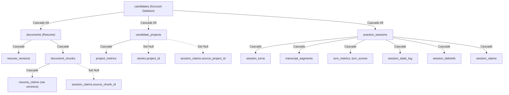

# Privacy & Data Lifecycle

PRAXIS enforces a strict deletion cascade and data retention lifecycle. We do not support "soft deletes" (e.g., `is_deleted = true`) for user-owned operational data; when a user requests deletion, their data is cryptographically and completely wiped from Postgres and object storage.

## The Deletion Cascade Graph

## Retention Policies

Raw audio from realtime sessions is **never persisted** to the database or object storage.
Transcripts (`transcript_segments`) and saved screenshots have a rolling retention window controlled by `user_settings.data_retention_days` (default 30 days). A daily scheduled background job purges older records and logs the event to `privacy_events`.
